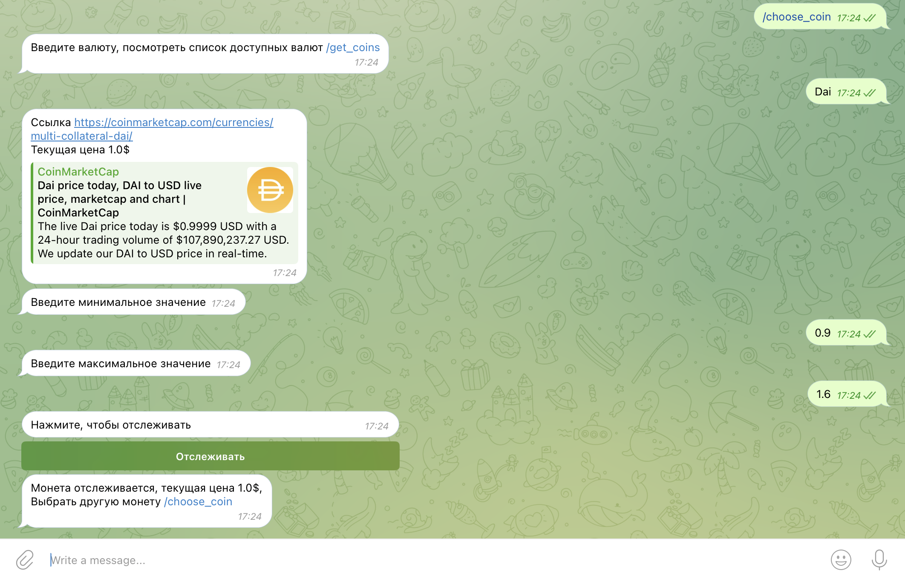

# Тестовое задание на позицию Junior+ Backend Разработчик в компанию "Авангард"

Необходимо написать скрипт для отслеживания курса выбранной криптовалюты через API сайта https://coinmarketcap.com/.
Курс отслеживается к паре USD.
Пользователь задает интересующую валюту и пороговое значение через телеграм, каким способом на усмотрение исполнителя (пишет в чате/канале или через бота или др.).
Уведомления о достижении порогового курса должны поступать в чат/канал телеграм.

Условия сдачи:

- реализация на Python;
- решение упаковано в Docker;
- возможность отслеживания нескольких криптовалют одновременно(будет чуть позже), хранение минимум двух значений для каждой валюты (условно максимальный и минимальный порог);
- предоставить краткий гайд по запуску кода и заданию курсов в телеграм;

## Установка

Клонировать репозиторий и перейти в него в командной строке:

```
git clone <repo.git>
cd test_task_avangard
```

Cоздать Docker образ и запустить контейнер:

```
docker build -t coin . && docker run -it coin
```

## Краткий гайд

1. Начать регистрацию токена для отслеживания /choose_coin
2. Ввести монету из списка /get_coins(левая колонка)
3. Ввести минимальное значение(float)
4. Ввести максимальное значение(float)
5. Начать отслеживать
6. Ждать
7. Чтобы остановить отслеживание, введите /stop

Просмотреть все доступные команды

```
/help
```

## Пример


